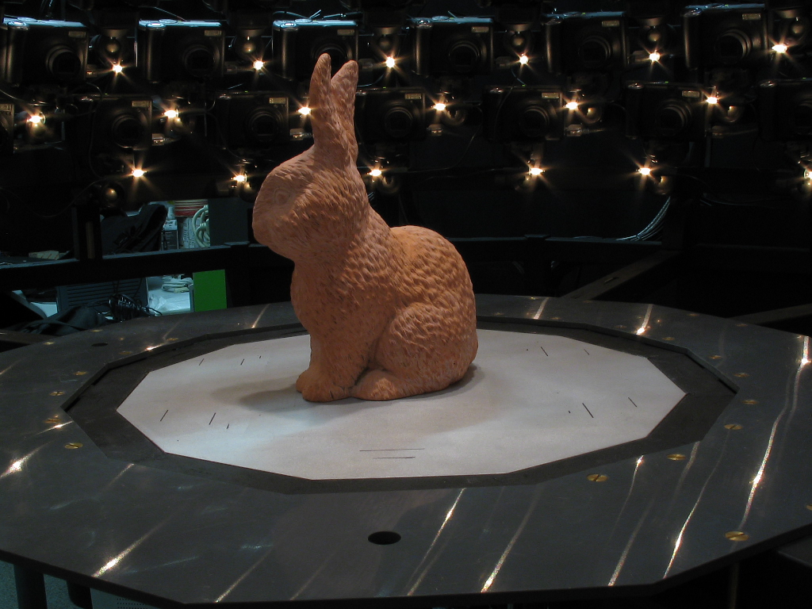
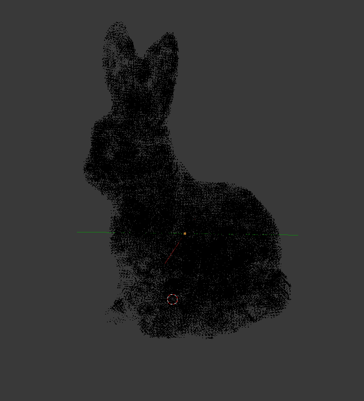
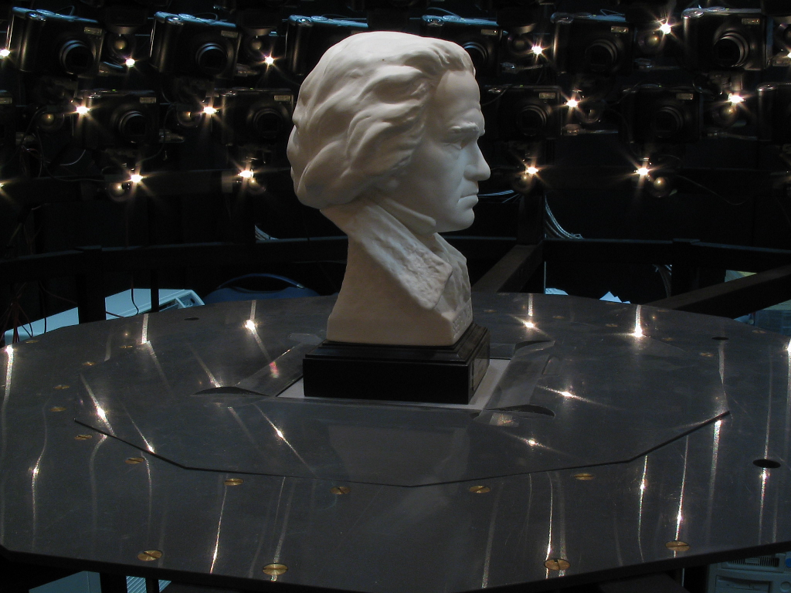
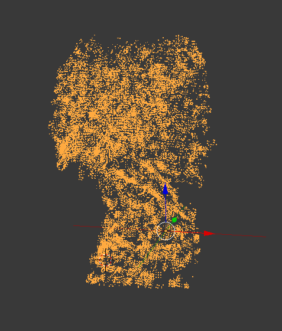
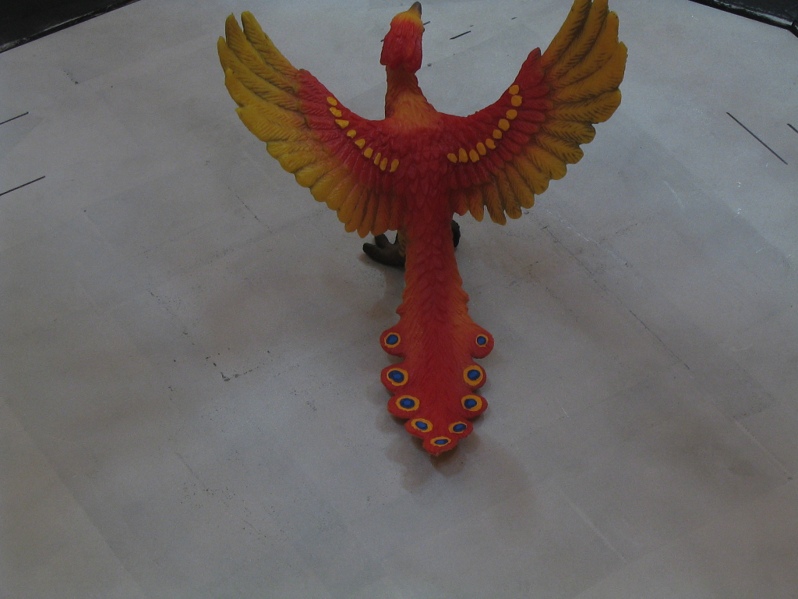
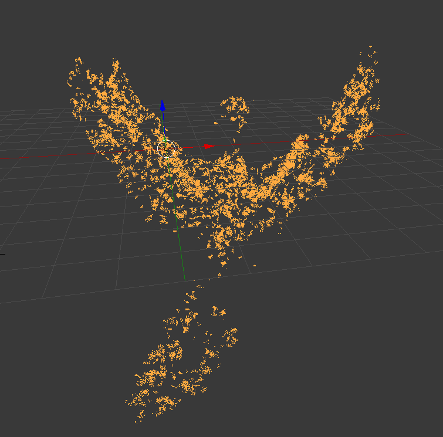
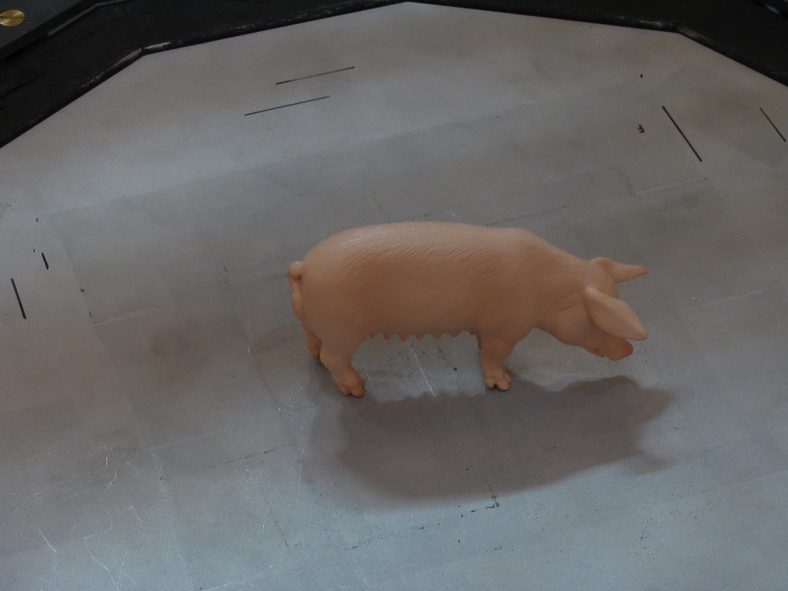
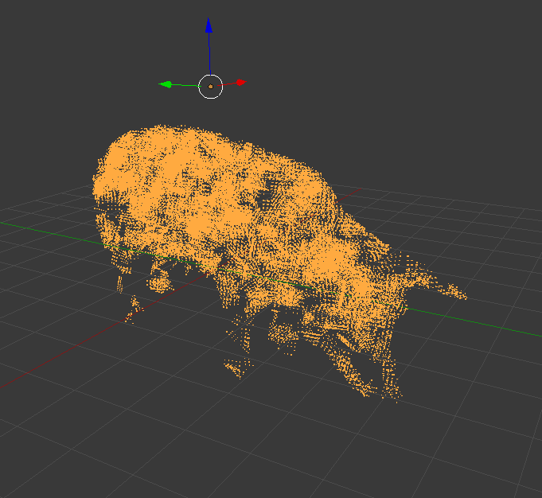

Cairo University
Computer Engineering Department
Image Processing Project

# 

Abstract {#abstract .unnumbered}
========

This report is about our implementation of the PMVS [1] algorithm for
multiview 3D reconstruction. The algorithm consists of three phases:
initial matching, expansion, and filtering. In the following sections we
will briefly give an overview of the algorithm, and the difficulties we
faced while implementing it.

Algorithm Overview {#algorithm-overview .unnumbered}
==================

Initial Matching {#initial-matching .unnumbered}
----------------

This phase aims at generating a sparse set of patches that can be
expanded later. This is done by first detecting a number of keypoints
(features) in each image. We use both Canny edge detector, and Harris
corner detector for this task.\
After the features have been detected, they are matched together in
pairs, such that they lie on the epipolar line of one another. We then
triangulate the 3D point associated with each pair, and use these points
as initial values for the centers of patches to be created. An
optimization routine is then run on these patches to achieve photometric
consistency.

Expansion {#expansion .unnumbered}
---------

Using the generated sparse set of patches, we try to expand them so as
to generate even more. This is done for a number of patches by
collecting points from the plane on which the patch lies, and then
running the optimization routine. Patches are expanded only when
necessary; however, we will not discuss the details here.

Filtering {#filtering .unnumbered}
---------

This is the weakest part of our implementation. Patches are filtered
only when they lie outside the visual hull. This requires some
preprocessing to segment each image into foreground and background.
Patches that lie inside the real surface are not filtered in the current
version.

Experiments {#experiments .unnumbered}
===========

We experimented on the “bird dataset”. Initially, the algorithm was
written in Python, and we used skimage for feature detection, scipy for
optimization, and numpy for linear algebra. But this resulted in a very
poor performance. The processing of a single image in the initial
matching phase took more than an hour! So we had to make changes.\

The first major change is replacing scipy with pybobyqa, which is a
Python implementation of the BOBYQA optimization algorithm. This cut the
time from over an hour to only fifteen minutes for each image. Scipy
took from 100-300 milliseconds for each patch to optimize, while
pybobyqa takes on average 0.5 millisecond, without being less accurate.\

The performance was still unacceptable, so we used Cython instead of
Python. Cython is a superset of Python that compiles into C. This
greatly boosted the performance by finishing each image in only 1
minute.\

The last major change is letting go of numpy in favor of BLAS. This
resulted in each image finishing in twenty seconds on average.

Accuracy and Performance {#accuracy-and-performance .unnumbered}
========================

Each image in the initial matching phase takes from 10 to 30 seconds.
Hence, for a 25 image dataset, initial matching can take up to 10
minutes. The rest of the algorithm can also take up to 10 minutes to
finish in some cases, depending on the number of times expansion is
done.\

No ground-truth is supplied with the datasets we used, so we have to
speak about the accuracy in a qualitative manner. The accuracy of the
implementation at the moment is ok, but not great. This is because the
filtering phase is not the best it can be at the moment. which results
in some outlier patches that blur the fine details of the model.

Weaknesses {#weaknesses .unnumbered}
==========

A disadvantage of this algorithm is that it results in a point cloud,
not a 3D mesh. Feature detection and initial matching is well
implemented. But the filtering phase still needs some work. This results
in a big number of patches that might not be all accurate, which results
in loss of detail. Also, this kind of algorithm should’ve been
implemented in C or C++, not in Python, since performance is very
important.

Test Cases {#test-cases .unnumbered}
==========

Figures 2, 3, 4 and 5 show the datasets we used to test the algorithm.

9 Yasutaka Furukawa, J Ponce, et al (2010). Accurate,
dense, and robust multiview stereopsis.

.5  [fig:sub1]

.5  [fig:sub2]

[fig:test]

.5  [fig:sub1]

.5  [fig:sub2]

[fig:test]

.5  [fig:sub1]

.5  [fig:sub2]

[fig:test]

.5  [fig:sub1]

.5  [fig:sub2]

[fig:test]
